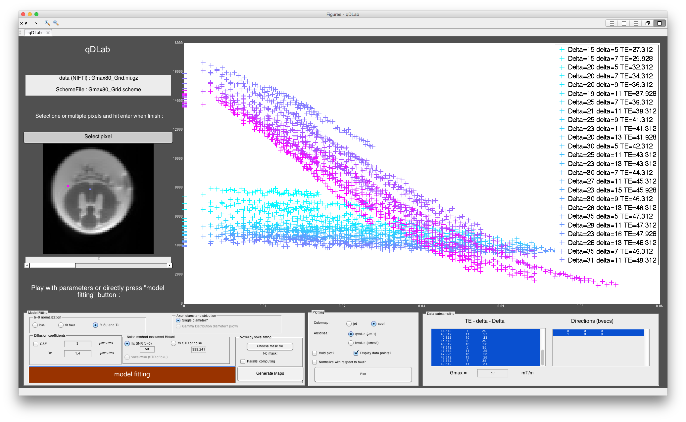

# qDLab
Quantitative Diffusion MRI Made Easy with qDLab: a Software for Data Visualization and Analysis of 1D qspac
e sampling

author : Tanguy Duval    
contact : tanguy.duval@polymtl.ca          
institution : University Polytechnique Montreal, NeuroPoly   
date : 2016 

## Preview data in 1 voxel + fitting

## Compare 2 voxels

## Subsample your dataset (e.g. Gmax = 40mT/m) and visualize them as you like (e.g. Xaxis:bvalue/qvalue)

