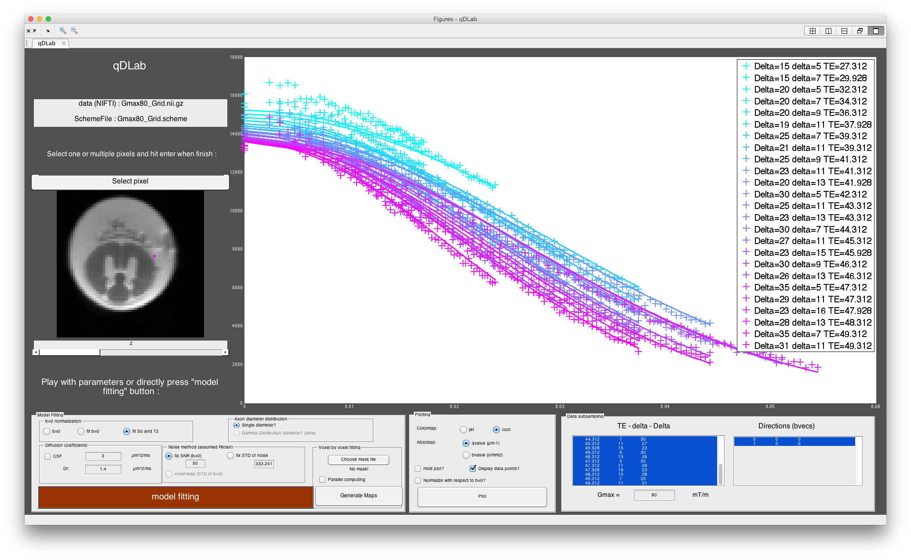
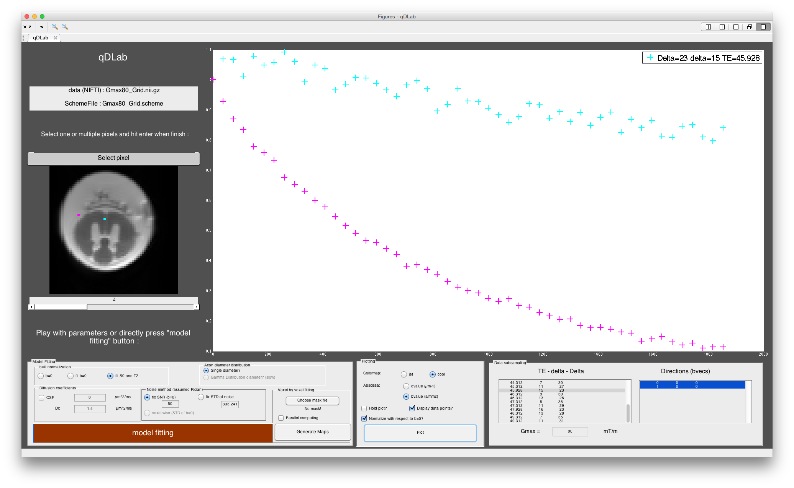
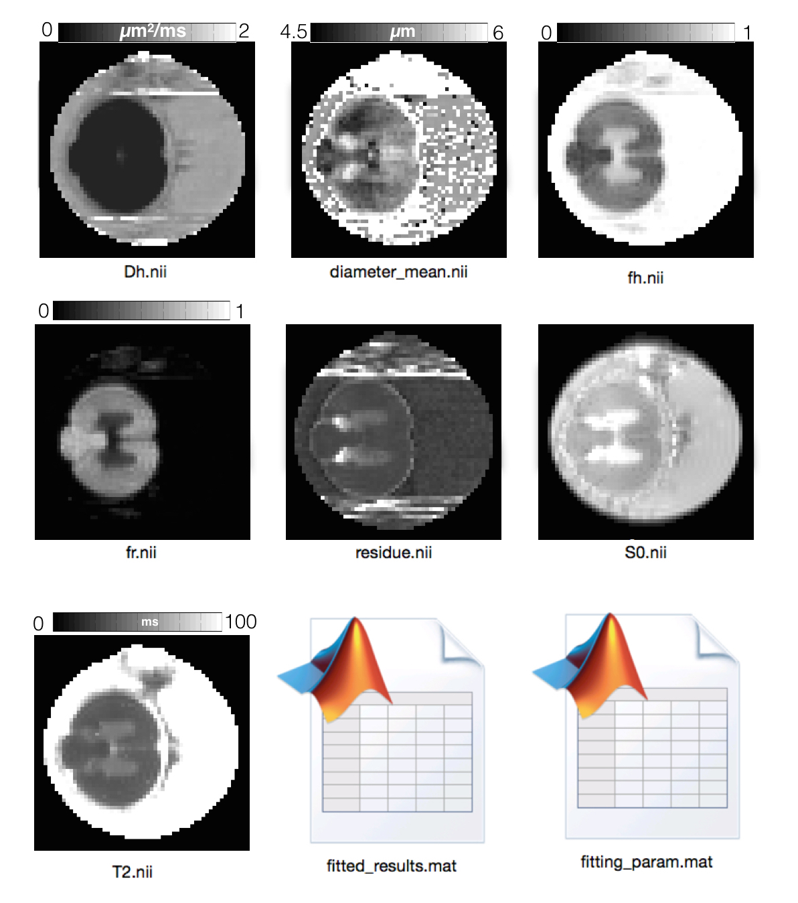

# qDLab
Quantitative Diffusion MRI Made Easy with qDLab: a Software for Data Visualization and Analysis of 1D qspace sampling

author : Tanguy Duval    
contact : tanguy.duval@polymtl.ca          
institution : NeuroPoly Lab, Polytechnique Montreal
date : 2016 

## Installation
- download and open the app : https://github.com/neuropoly/qDLab/releases/tag/v1.4
- Launch the app from Matlab App tab
- The app will propose you to open a NIFTI file. Open one of the two [example dataset](example_dataset/exvivo/cat_2Dqspace.nii.gz).
- The app will propose you to open a schemefile. Open one of the two [example dataset](example_dataset/exvivo/2D_qspace.scheme).
- select a pixel and press enter --> the MRI signal in this particular pixel will be plotted
- Click on "model fitting" button --> CHARMED model will be fitted on the data. Results are displayed in the Matlab console
- Click on "Generate Map" button --> A folder will be generated with all the fitted maps.

## Enable NODDI
- install the NODDI toolbox : http://www.nitrc.org/projects/noddi_toolbox
- add the NODDI model to qDLab :
  - download and copy [NODDI plugin](code/CUSTOM/NODDI.m) to *qDLab/code/CUSTOM/NODDI.m*  
  *NB: qDLab folder can be found using the following Matlab command : ````which qDLab.m````*
  - close and restart qDLab


## Support
Use [GitHub issue](https://github.com/neuropoly/qDLab/issues/new) to report any error or for help. Expect an answer in <24h.

## Schemefile
The schemefile describes the diffusion protocol associated to your dataset. 
Example of schemefile : [336810.scheme](example_dataset/invivo/336810.scheme)

You can generate your schemefile using the function [scd_schemefile_create](code/scd_schemefile_create.m).  
See Examples:  
```>> help scd_schemefile_create```  
If acquired two datasets with the same *bvecs.txt* but different diffusion times (20 and 35ms):  
```
bvecs_files = {'bvecs.txt', 'bvecs.txt'};   
add_b0_beginning = 0;   
DELTA       = [20 35]*1e-3; % s  
delta       = [8  8 ]*1e-3; % s   
Gmax        = [380 380]*1e-3; % T/m   
TE          = [69 70]*1e-3; %s   
acq_basename= date;   
scd_schemefile_create(bvecs_files, add_b0_beginning, DELTA, delta,Gmax, TE, acq_basename);
```


For more info see the description of the **STEJSKALTANNER** schemefile on the following link:
http://camino.cs.ucl.ac.uk/index.php?n=Docs.SchemeFiles


## Features
### Preview data in 1 voxel + fitting


### Compare 2 voxels


### Subsample your dataset (e.g. Gmax = 40mT/m) and visualize them as you like (e.g. Xaxis : bvalue or qvalue?)


### Generate "AxCaliber" Maps


## Preprocessing
Use your favourite software for motion correction, distortion correction, and merge your diffusion data in one NIFTI file (also merge your schemefiles accordingly!) 


